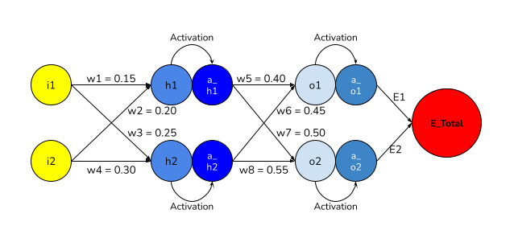

# tsai_end2.0_Session_2
The School of AI repo for END 2.0 Session 2

---

## Rewrite the whole excel sheet showing backpropagation. Explain each major step, and write it on Github.
Here we show a sample network for the purpose of this exercise. For the simplicity of calculation we avoid the usage of biases in the network.



Below is the image of the backpropagation (created in excel, link provided above) that was done in the session.


Here we are going through 39 iterations of backpropagation and plotting th chart below.

The learning rate (η) taken here is 0.5 and the activation function for this calculation exercise is fixed at sigmoid (σ) [1/(1+e^(-x)].


Here we have used the exact same parameter values that has been discussed in the session. Below listed are the initial values and brief description for each of the acronyms. (based on the network mentioned in the image)
1. i1 = 0.05 (input 1 - 1st input pvorided to the network).
2. i2 = 0.10 (input 2 - 2nd input pvorided to the network).
3. t1 = 0.01 (target 1 -  1st actual value).
4. t2 = 0.99 (target 2 -  2nd actual value).
5. h1 = 1st neuron of the hidden layer.
6. h2 = 2nd neuron of the hidden layer.
7. w1 = 0.15 (w1 is the weight connection between input 1 [i1] to 1st neuron of the hidden layer [h1]).
8. w2 = 0.20 (w2 is the weight connection between input 2 [i2] to 1st neuron of the hidden layer [h1]).
9. w3 = 0.25 (w3 is the weight connection between input 1 [i1] to 2nd neuron of the hidden layer [h2]).
10. w4 = 0.30 (w4 is the weight connection between input 2 [i1] to 2nd neuron of the hidden layer [h2]).
11. a_h1 = 1st neuron of the hidden layer activated by some activation funtion, in this case sigmoid.
12. a_h2 = 2nd neuron of the hidden layer activated by some activation funtion, in this case sigmoid.
13. O1 = 1st neuron of the output layer.
14. O2 = 2nd neuron of the output layer.
15. w5 = 0.40 (w5 is the weight connection between activated 1st hidden neuron [a_h1] to 1st neuron of the output layer [O1]).
16. w6 = 0.45 (w6 is the weight connection between activated 2nd hidden neuron [a_h2] to 1st neuron of the output layer [O1]).
17. w7 = 0.50 (w7 is the weight connection between activated 1st hidden neuron [a_h1] to 2nd neuron of the output layer [O2])
18. w8 = 0.55 (w8 is the weight connection between activated 2nd hidden neuron [a_h2] to 2nd neuron of the output layer [O2])
19. a_O1 = 1st neuron of the Output layer activated by some activation funtion, in this case sigmoid. 1st Predicted value of the network.
20. a_O2 = 2nd neuron of the Output layer activated by some activation funtion, in this case sigmoid. 2nd Predicted value of the network.
21. E1 = Error or loss from the 1st activated Output Neuron, defined as a function of difference between prediction and actual.
22. E2 = Error or loss from the 2nd activated Output Neuron, defined as a function of difference between prediction and actual.
23. E_Total = Total Error or loss of the network, i.e., Total of the error from both the output neurons.
24. η = Learning Rate of the network.

In the above description i1, i2, t1, t2 remain constant throughout. Other metrics are parameters which change through the process of back propagation while training the network.
Learning Rate (η) of the network is a hyperparameter along with the activation function which can be set by the user prior to training the network.

## Formulae for calculation of the above parameters only (forward propagation)
    h1 = w1 * i1 + w2 * i2
    h2 = w3 * i1 + w4 * i2
    a_h1 = σ(h1)
    a_h2 = σ(h2)
    o1 = w5 * a_h1 + w6 * a_h2
    o2 = w7 * a_h1 + w8 * a_h2
    a_o1 = σ(o1)
    a_o2 = σ(o2)
    E1 = 0.5 * (t1 - a_o1)^2
    E2 = 0.5 * (t2 - a_o2)^2
    E_Total = E1 + E2

σ above represents sigmoid activation function [Formulae: 1/(1+e^(-x)]

## Derivation of backpropagation (Explain each major step)
Since our primary objective is to reduce error or the difference between prediction and actual output (remaining constant, denoted by t1 and t2), we need to change our parameters/weights (w1 to w8) as they are affecting the prediction value. This in turn changes the values of h1, h2 and O1, O2 (O1, O2 being the predicted values).

Backpropagation calculates the gradients of error function with respect to weights. The calculation proceeds backwards through the network changing the weights so as to reduce the error. Here we assume that when one of the weights is changed the other weights remain constant.

Now lets go ahead and canculate the gradient of error with respect to different parameters of the network.
```
    ∂E_Total/∂w5 = ∂(E1 + E2)/∂w5 ... (1)
    ∂(E1 + E2)/∂w5 = ∂(E1)/∂w5 ... (2)
    ∂(E1)/∂w5 = (∂E1/∂a_o1)*(∂a_o1/∂o1)*(∂o1/∂w5) ... (3)
```
Here in eq (2) we remove E2 since in the network above E2 not getting generated by w5 and hence the gradient for E2 w.r.t. w5 will be 0. Hence, applying the chain rule to eq (2) we get eq (3).
```
    ∂E1/∂a_o1 = ∂(0.5 * (t1 - a_o1)^2) / ∂a_o1 = (t1 - a_o1)*(-1) = a_o1 - t1 ... (3.1)
    ∂a_o1/∂o1 = ∂(σ(o1))/∂o1 = σ(o1) * (1-σ(o1)) = a_o1 * (1-a_o1) ... (3.2)
    ∂o1/∂w5 = a_h1 ... (3.3)

    Hence,
    ∂(E_Total)/∂w5 = (a_o1 - t1) * (a_o1 * (1-a_o1)) * (a_h1)
    Similarly, we get
    ∂(E_Total)/∂w6 = (a_o1 - t1) * (a_o1 * (1-a_o1)) * (a_h2)
    ∂(E_Total)/∂w7 = (a_o1 - t1) * (a_o1 * (1-a_o2)) * (a_h1)
    ∂(E_Total)/∂w8 = (a_o1 - t1) * (a_o1 * (1-a_o2)) * (a_h2)
```
Breaking eq (3) above into each of the components we get the above equations (3.x).

```
    ∂E_Total/∂a_h2 =  (a_o2 - t2) * (a_o2) * (1-a_o2) * w8 + (a_o1 - t1) * (a_o1) * (1-a_o1) * w6

    ∂E_Total/∂a_h1 = ∂(E1 + E2)/∂a_h1
    ∂(E1)/∂a_h1 = ∂(E1 )/∂a_o1 * ∂a_o1/o1 * ∂o1/∂a_h1 = (a_o1 - t1) * (a_o1) * (1-a_o1) * w5 +  (a_o2 - t2) * (a_o2) * (1-a_o2) * w7

    ∂E_Total/∂w1  = ∂E_Total/∂a_o1 * ∂a_o1/∂o1 * ∂o1/∂a_h1 * ∂a_h1/∂h1 * ∂h1/∂w1
    ∂E_Total/∂w1  = ∂E_Total/∂a_h1  *  ∂a_h1/∂h1  *  ∂h1/∂w1
    ∂E_Total/∂w1  = ∂E_Total/∂a_h1  *  a_h1* (1-a_h1)  *  ∂h1/∂w1
    ∂E_Total/∂w1  = ∂E_Total/∂a_h1  *  a_h1* (1-a_h1)  * i1
    ∂E_Total/∂w2  = ∂E_Total/∂a_h1  *  a_h1* (1-a_h1)  * i2
    ∂E_Total/∂w3  = ∂E_Total/∂a_h2  *  a_h2* (1-a_h2)  * i1
    ∂E_Total/∂w4  = ∂E_Total/∂a_h2  *  a_h2* (1-a_h2)  * i2

    ∂E_Total/∂w1  = ((a_o1 - t1) * (a_o1) * (1-a_o1) * w5 + (a_o2 - t2) * (a_o2) * (1-a_o2) * w7 ) * a_h1 * (1-a_h1) * i1
```
Hence, by the above methods and equations we calculate the gradient of error w.r.t. different weights of the network.

To update the weights we use the learning rate given by the formulae below
```
    w_new = w_old - (η * ∂(E_Total)/∂w_old)
```


## Changes to backward propagation of error with each step when Learning Rate (η) of the network is changed.
#### Learning rate changed to 0.1


#### Learning rate changed to 0.2


#### Learning rate changed to 0.5


#### Learning rate changed to 0.8


#### Learning rate changed to 1.0


#### Learning rate changed to 2.0

